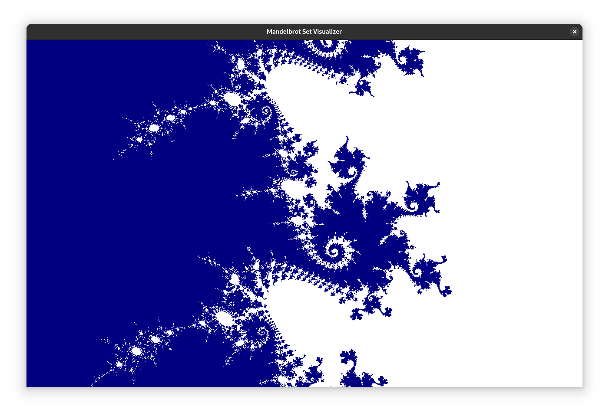

# Mandelbrot set visualizer in SDL 3

An unoptimized [Mandelbrot set](https://en.wikipedia.org/wiki/Mandelbrot_set)
visualizer written in C99.

This program uses SDL 3 and OpenGL ES 3.0.

## Screenshot

## Building

This program has only been tested on Linux but should also work on macOS,
Windows or any BSD that supports SDL and OpenGL.

To build, simply run `make`.

## Controls

  * Click and drag with the primary mouse button to select a section of the
    visible area and zoom into it.
  * Click and drag with the tertiary (middle) mouse button to pan.
  * Scroll in and out to zoom.

## Caveats

  * Every draw call re-renders every visible pixel. This could be optimized by
    rendering to an off-screen framebuffer.
  * If you zoom in too much, the floating-point values run out of precision and
    you will see rectangles.
  * No antialiasing/supersampling

## License

Copyright (c) 2025 Charles Hood <chood@chood.net>

This program is free software: you can redistribute it and/or modify it under
the terms of the GNU General Public License as published by the Free Software
Foundation, either version 3 of the License, or (at your option) any later
version.

This program is distributed in the hope that it will be useful, but WITHOUT ANY
WARRANTY; without even the implied warranty of MERCHANTABILITY or FITNESS FOR A
PARTICULAR PURPOSE. See the GNU General Public License for more details.

You should have received a copy of the GNU General Public License along with
this program. If not, see <https://www.gnu.org/licenses/>.
